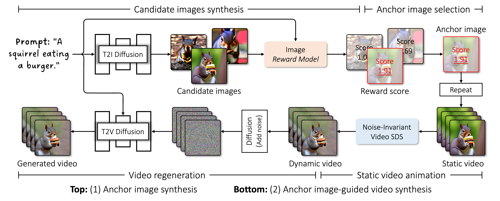

## I4VGen: Image as Stepping Stone for Text-to-Video Generation<br><sub>Official PyTorch implementation of the arXiv 2024 paper: https://arxiv.org/abs/2406.02230</sub>



**I4VGen: Image as Stepping Stone for Text-to-Video Generation**<br>
Xiefan Guo, Jinlin Liu, Miaomiao Cui, Di Huang<br>
https://xiefan-guo.github.io/i4vgen<br>

Abstract: *I4VGen is a training-free and plug-and-play video diffusion inference framework, which decomposes text-to-video generation into two stages: anchor image synthesis and anchor image-guided video synthesis. It employs a generation-selection strategy for the anchor image, synthesizing candidate images and selecting the most appropriate one based on a reward mechanism to ensure close alignment with the text prompt. Subsequently, a novel Noise-Invariant Video Score Distillation Sampling is developed to animate the image to a video, followed by a video regeneration process to refine that, thereby significantly improving the video quality.*

**Note:** We plan to open source this work, which is currently going through the disclosure process. We look forward to the approval and open-sourcing.

## Citation

```bibtex
@article{guo2024i4vgen,
    title   = {I4VGen: Image as Stepping Stone for Text-to-Video Generation},
    author  = {Guo, Xiefan and Liu, Jinlin and Cui, Miaomiao and Huang, Di},
    journal = {arXiv preprint arXiv:2406.02230},
    year    = {2024}
}
```